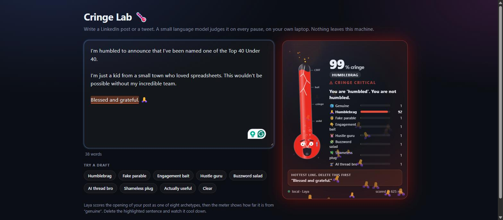
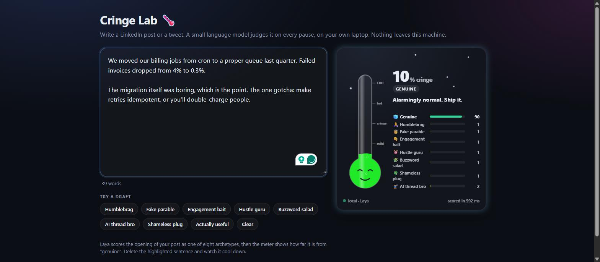
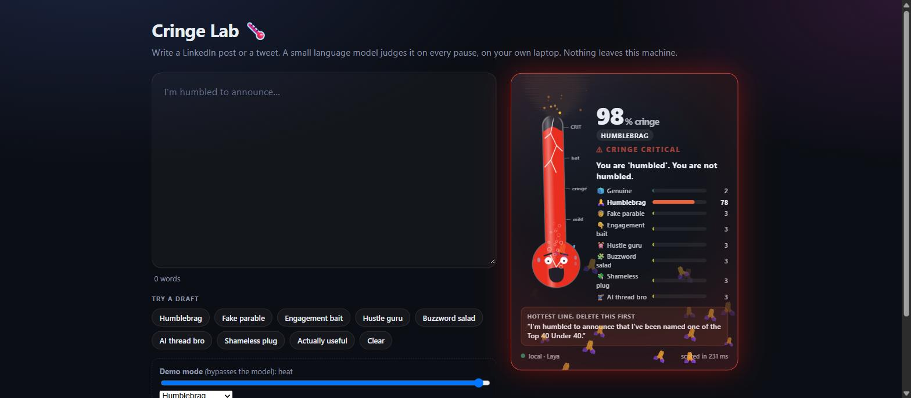

# Cringe Meter 🌡️

A thermometer for LinkedIn and X drafts. It reads what you type and decides which kind of post you are writing.
Humblebrags and fake parables about wise Uber drivers make it heat up, and deleting the sentence it highlights cools it
down again. A small model called [Laya](https://github.com/NandhaKishorM/laya) does the judging on your own machine, so
the draft never goes anywhere.

I built it to find out whether a small model could judge text fast enough to keep up with typing on a standard laptop CPU. Turns out after a bit of fine-tuning, it can do just that, at about a quarter of a second per check (obvs even faster with a GPU).



<table>
<tr>
<td width="50%"></td>
<td width="50%"></td>
</tr>
<tr>
<td align="center">A sincere post stays cool (real model output)</td>
<td align="center">Meltdown, drawn with the demo slider</td>
</tr>
</table>

## The eight archetypes

Laya gives a probability for each of eight kinds of post in a single pass. The thermometer shows 1 minus the probability
of "genuine", names the leading archetype, and points at the sentence to delete first.

| Archetype | Sounds like |
|---|---|
| genuine | specific, honest, useful, or a plain update |
| humblebrag | "humbled and honored to announce…" |
| fake parable | the wise Uber driver, janitor or intern with a tidy moral |
| engagement bait | "Agree? Comment YES and I'll DM you…" |
| hustle guru | "Nobody is coming to save you. Wake up at 5AM." |
| buzzword salad | "leverage holistic, best-in-class synergies…" |
| shameless plug | "Only 3 spots left. Link in bio." |
| AI thread bro | "10 AI tools that will replace your job 🧵" |

Laya cannot write text, so the one-liners under the thermometer are canned lines that the code picks from the leading
archetype.

## The thermometer

The heat rises fast and falls slowly, so when you cut a cringe sentence you can watch it cool.

| Cringe | Look |
|---|---|
| 0-12% | frost and snowflakes, sleepy smile |
| 12-40% | green to yellow, calm bubbles |
| 40-65% | orange, sweat drops |
| from 55% | the thermometer starts to shake |
| from 72% | smoke |
| from 90% | cracked glass, sparks, red flashing, "CRINGE CRITICAL" |

The leading archetype rains its own emoji (🙏 👇 ⏰ 🧵). The meter waits for two sentences before it judges, so a normal
post is not written off after three words. It respects `prefers-reduced-motion`.

## Running it

There are two front ends: the Cringe Lab, a local page at `http://127.0.0.1:8780/` where you type or click a sample draft,
and a Chrome extension that puts a floating meter on the post box at linkedin.com and x.com. Add `?demo=1` to the Lab
address for a slider that drives the meter by hand, which is handy for screen recordings.

The trained model is on Hugging Face at [Hamzonium/cringe-meter-v2](https://huggingface.co/Hamzonium/cringe-meter-v2)
(1.3 GB), so you do not need to train anything. You need Python 3.10 or newer and about 4 GB of free RAM. Laya's base
checkpoints also download from Hugging Face on first use (about 2.3 GB).

```bash
python -m venv .venv
.venv/Scripts/activate            # Windows; on macOS or Linux: source .venv/bin/activate
pip install torch --index-url https://download.pytorch.org/whl/cpu
pip install laya huggingface_hub

hf download Hamzonium/cringe-meter-v2 --local-dir out/cringe_v2
python server.py                  # Windows: start-server.cmd
```

To train your own instead, generate the data and train:

```bash
python gen_synthetic.py --v2                                        # writes data/synth_v2.jsonl, about 6,200 posts
python train.py out/cringe_v2 --synth data/synth_v2.jsonl
```

The server prints its address once the model has loaded, which can take up to a minute. For the extension, open
`chrome://extensions`, switch on Developer mode, choose **Load unpacked**, pick the `extension/` folder, then refresh
LinkedIn or X and click into the post box. A "🌡 Cringe Meter is on" badge shows for a few seconds when the extension
loads on a page.

To end a training run early without losing the best epoch so far, create a file called `STOP` in the repository folder.

## How it works

Zero-shot Laya cannot do this task. On the test posts it scored 21% accuracy against 12.5% for chance, and its cringe
score ranked genuine posts below cringe ones (AUC 0.40). Fine-tuning fixes that.

The training data is synthetic. Each archetype has hand-written openers, middles and closers that get assembled into
posts, and the same formatting and emoji are applied to every class, so line breaks and rocket emoji carry no label.
Validation uses pieces that never appear in training.

On LinkedIn the post box is a modal `<dialog>` inside an open shadow root. The browser draws modals above everything else,
and anything outside them cannot be clicked, so the extension puts the meter inside that dialog as a popover. It sits above
the dark backdrop and still takes clicks. It also recovers on its own if the site removes the card or swaps the editor.

(A check takes about 250 ms on a laptop CPU and ~30ms on GPU.)

## How far to trust it

| Fresh test set (64 posts, 8 per class) | Result |
|---|---|
| Accuracy over the 8 archetypes | 81% (chance is 12.5%) |
| Cringe-score AUC, genuine against cringe | 0.96 |
| Genuine posts wrongly rated above 50% cringe | 25% (2 of 8) |

The same author wrote the training templates and every test post, so the test is only partly independent. Real posts are
the proper test, and I have not run that yet. With 8 posts per class, a single mistake moves a score by about 1.6 points.

I should also say that an earlier test set was meant to be blind, but the training templates were then written from it, and 80% of its posts
turned up almost word for word in training. Its 94% score means nothing. `leakage.py` measures that overlap, and the table
above comes from a set with 3%.

There are misses too: subtle humblebrags read as genuine, a sincere hiring post scored as a plug, a very short fake parable slipped
through, and the "here's to the builders and the makers" manifesto style has no archetype at all.
[`docs/example-posts.md`](docs/example-posts.md) lists posts that set off the alarm and posts that stay cool, with scores.

## Files

| Path | Contents |
|---|---|
| `web/meter.js` | the whole visual, no dependencies. `python build_extension.py` copies it into `extension/` |
| `web/lab.html` | the Cringe Lab page. `web/harness.html` stands in for the LinkedIn and X post boxes in tests |
| `extension/` | the Chrome extension: `content.js` finds the post box and draws the card, `background.js` relays to localhost |
| `server.py` | the local Laya server with `/score` and `/hot`; it warms the model up and keeps it warm |
| `schema.py`, `gen_synthetic.py`, `synth_extra.py` | the eight archetypes and the synthetic training data |
| `train.py`, `evaluate.py`, `leakage.py`, `test_*.py` | training, evaluation, the template-leak check and the test posts |
| `score_examples.py` | scores any list of posts on the running server |

## Troubleshooting

If nothing appears on LinkedIn, reload the extension on `chrome://extensions` and refresh the LinkedIn tab. The badge shows
the extension's version, and any error appears as a red note at the bottom left.

If the first score is slow or times out, check your free RAM. The model needs about 1.5 GB resident, and on a machine short
of memory the OS pages an idle model out to disk. The server pings the model regularly to keep it in memory.

If the card says it is waiting for the local server, start `server.py`.

## Limitations

I have only tried it on Chrome and Windows 11. LinkedIn and X change their pages. The extension attaches to any large
editable box on those two sites, so it does not depend on their exact markup, though that guarantees nothing. It judges
style and says nothing about whether an idea is good or true. It works in English only, and the eight archetypes are just a bit of fun for me.

## Credits and license

Built by Hamza Zakir with Claude Code, on [Laya](https://github.com/NandhaKishorM/laya) by Convai Innovations
(Apache-2.0). Laya's model files download from Hugging Face on first run and are not part of this repository.

The code is [MIT](LICENSE) licensed.
